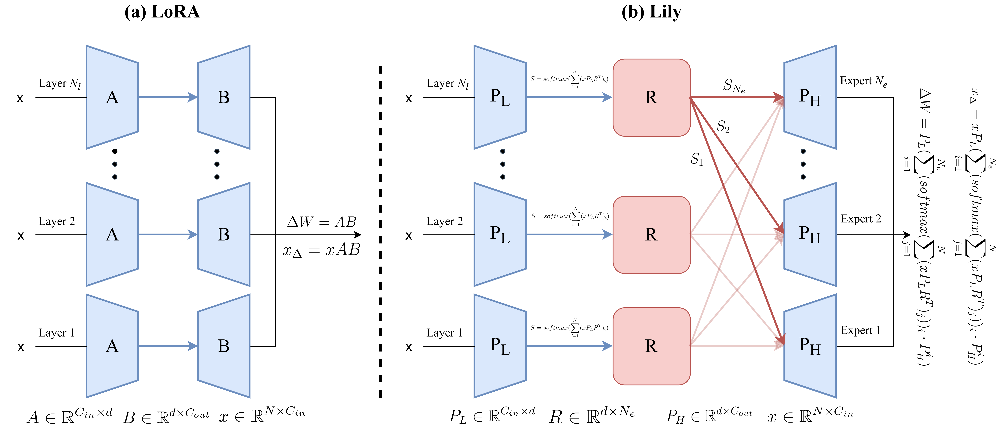

<div align="center">

# Lily ⚜️

### Low-Rank Interconnected Adaptation across Layers

[](https://arxiv.org/abs/2407.09946)

</div>

---

## 📌 Overview

**Lily** (Low-Rank Interconnected Adaptation across Layers) is a PEFT method that aims to allow higher-rank and dynamic updates with the same parameters budget.

<p align="center">
  
</p>

## 📄 Paper
Read our paper on arXiv: [Low-Rank Interconnected Adaptation across Layers](https://arxiv.org/abs/2407.09946)

## 🧪 Experiments
**Experiment setups from the paper are located in each subfolder.**

## 📝 Citation
If you find Lily useful for your research, consider citing our paper:

```
@misc{zhong2025lowrankinterconnectedadaptationlayers,
      title={Low-Rank Interconnected Adaptation across Layers}, 
      author={Yibo Zhong and Jinman Zhao and Yao Zhou},
      year={2025},
      eprint={2407.09946},
      archivePrefix={arXiv},
      primaryClass={cs.CV},
      url={https://arxiv.org/abs/2407.09946}, 
}
```
