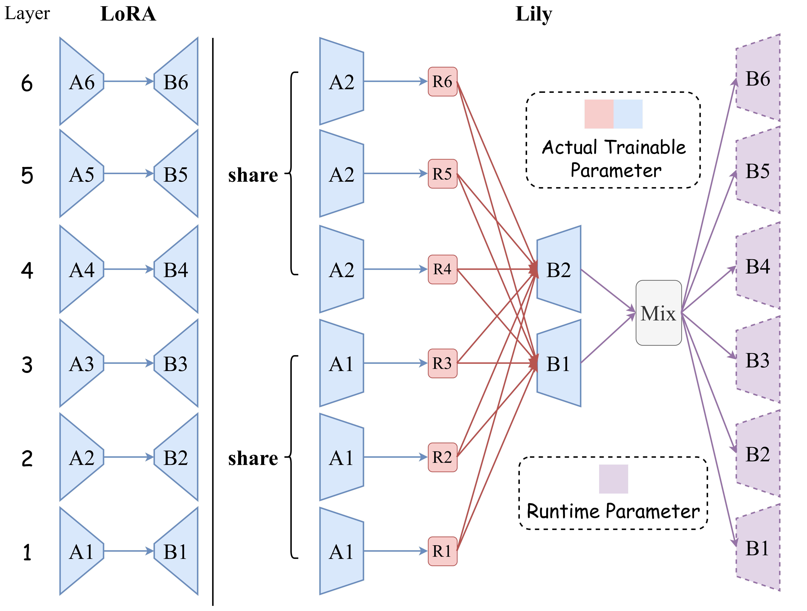

<div align="center">

# Lily ⚜️

### Low-Rank Interconnected Adaptation across Layers

[](https://arxiv.org/abs/2407.09946)
[](https://opensource.org/licenses/MIT)

</div>

---

## 📌 Overview

**Lily** (Low-Rank Interconnected Adaptation across Layers) is a novel PEFT method with cross-layer connections, allowing each layer to access information from all other layers during the adaptation process, as well as high-rank weight updates.

<p align="center">
  
</p>

## 📄 Paper
Read our paper on arXiv: [Low-Rank Interconnected Adaptation across Layers](https://arxiv.org/abs/2407.09946)

## 🧪 Experiments
**Experiment setups from the paper are located in each subfolder.**

## 📝 Citation
If you find Lily useful for your research, please consider citing our paper:

```
@misc{zhong2024lowrankinterconnectedadaptationlayers,
      title={Low-Rank Interconnected Adaptation across Layers}, 
      author={Yibo Zhong and Yao Zhou},
      year={2024},
      eprint={2407.09946},
      archivePrefix={arXiv},
      primaryClass={cs.CV},
      url={https://arxiv.org/abs/2407.09946}, 
}
```